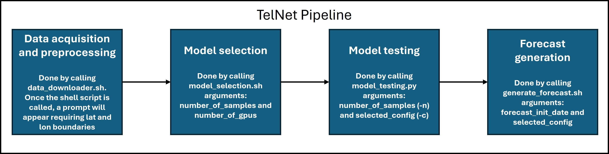

# TelNet

- This repository contains TelNet codes described in the paper ["An interpretable machine learning model for seasonal precipitation forecasting"](https://www.nature.com/articles/s43247-025-02207-2). 
- The pipeline is composed of four processes as in the figure below

- The data_downloader.sh is responsible for data acquisition and preprocessing.
- The model_selection.sh executes model selection based on N gridsearch samples.
- The model_testing.py trains the final model with the selected configuration and tests it on N bootstrapped out-of-sample test set.
- The generate_forecast.sh is used to generate real-time forecasts after the final model is created. 
- More information about necessary input arguments is provided inside each shell script.
- Using different versions of libraries may lead to different results due to stochastic nature of the algorithms, thus it is recommended to use the container provided. Further instructions on how to mount and use the container are provided in docker directory.
- Before running TelNet pipeline, numerical and machine learning models dataset used as baseline should be downloaded from this ['link'](https://drive.google.com/file/d/1EMJr323Oz7j4GIqsV3Bmcv2TklrmBTb7/view?usp=drive_link). Once the dataset is downloaded, an environmental variable **"TELNET_DATADIR"** should be set to the path of the downloaded dataset.
- ERA5 dataset required to train and evaluate the model is downloaded using the data_downloader.sh. However, it requries to have access to Copernicus Climate Data Store API and having .cdsapirc file in your machine. Once this file is created, an environmental variable **"CDSAPI_RC"** should be set to the path of .cdsapirc. In order to have access to Climate Data Store API, please follow this ['guideline'](https://cds.climate.copernicus.eu/how-to-api)
- Release [v1.0.0](https://github.com/enzopinheiro/telnet/tree/v1.0.0) provides the code to reproduce the results of "An interpretable machine learning model for seasonal precipitation forecasting" by E. Pinheiro and T. B. M. J. Ouarda. It requires about 16GB of VRAM and takes about a 4 days to run the full sampling procedure on a single A100 GPU.
